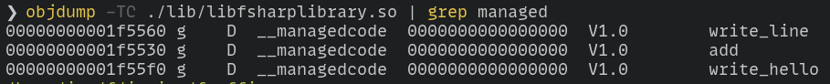

# F# FFI examples

all examples are for linux, adjust for your own operating system

#### build shared native library from F#

*on other platforms change "linux-x64" to [another RID](https://learn.microsoft.com/en-us/dotnet/core/rid-catalog)* e.g "win-x64", "osx-x64"

```bash
cd "src/fsharp-native-shared-library"
dotnet publish /p:NativeLib=Shared -c Release -r linux-x64 -o ../../lib
```

after that the functions are exported to the shared library as such:



#### use native library from F#

.NET uses `LD_LIBRARY_PATH` to resolve native libraries

*bash*
```bash
export LD_LIBRARY_PATH="$PWD/lib"
dotnet fsi ./src/fsharp-call-native-library/native.fsx
```

*pwsh*
```powershell
$env:LD_LIBRARY_PATH = "$PWD/lib"
dotnet fsi ./src/fsharp-call-native-library/native.fsx
```

to have resolve native libraries in vscode fsi set the env before launching code e.g.

```bash
$env:LD_LIBRARY_PATH += ":lib/"
code .
```

#### use NativeAOT F# from C++

*this example is for linux, adjust compile_and_run.sh for your own platform*

```bash
cd "src/cpp-call-native-fsharp"
./compile_and_run.sh
```